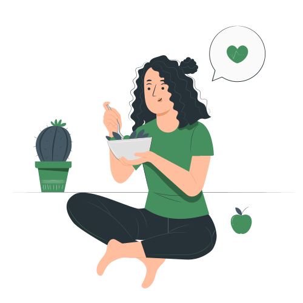
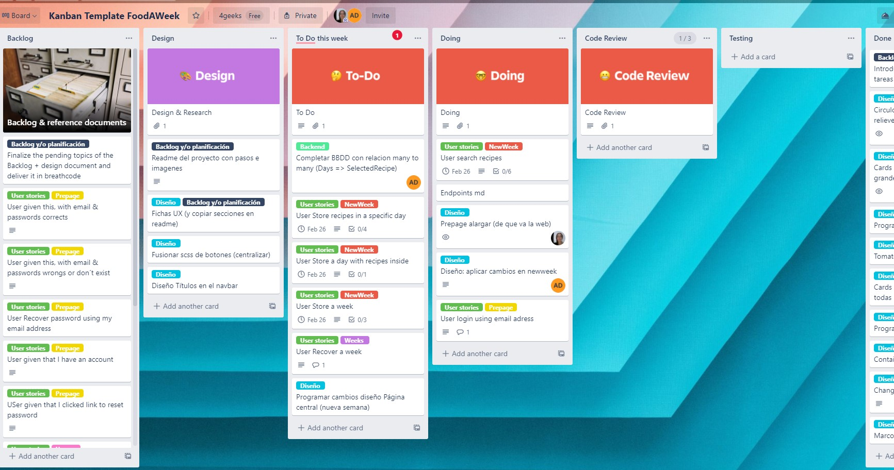

# FoodAWeek project

This is the final project of <a href="https://github.com/Alvarodevs"> Alvaro Garzón </a> and <a href="https://github.com/nitlara"> Anna Lara </a> in the <a href="https://github.com/4GeeksAcademy">4geeksAcademy </a> FullStackDeveloper program.

# About FoodAWeek 

![freepik storyset]

## What is it ?

FoodAWeek is a tool to systematize the creation of weekly menus with many recipes at your fingertips.

Look for recipes! Make your menus! Save them! reuse them!

**Save time to eat great.**

## Why now!?

Why not? You are what you eat, fill your fridge with a plan for your stomach! And when you don't feel like it, save a week saved.

# About us
<a href="https://github.com/Alvarodevs"> Alvaro Garzón </a> 

<a href="https://github.com/nitlara"> Anna Lara </a>

## Languages & Technologies & main libraries used for the project

### Frontend

REACT JS
CSS
SASS
BOOTSTRAP
Bootstrap icons
Leaflet
Toastify
Debounce

### Backend

Python
SQLAlchemy
Flask jwt
werkzeug

## Resources

### Design 

Draw io, 
Canva

### How we organize the project

Trello , 
Github

# WebApp boilerplate with React JS

## Thanks for the advice and patience to our tutor and mentors

@enaguero, 
@LuisSanchezArevaloRionegro, 
@sergioadll, 
@Diego-EC.
